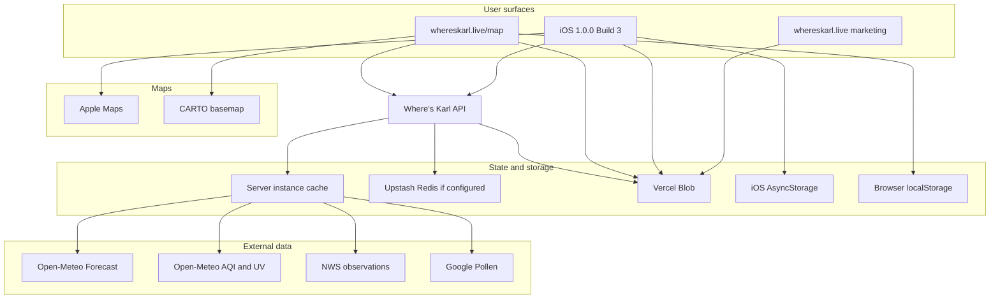
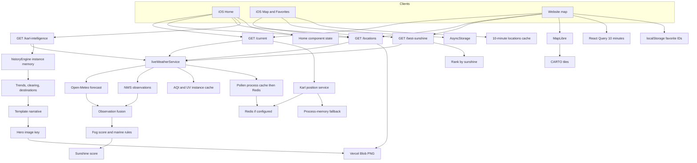

# Where's Karl — Current Production Architecture

**Status:** current-state record from Phase A1 discovery, approved for documentation in Phase A2.
**Audience:** product owner, technical lead, new engineer.
**Scope:** what is in production now. Deferred work is listed separately and is not drawn as current architecture.

This document does not collapse iOS, the website, and the API into one commit. Those surfaces are deployed independently and currently sit on different source checkpoints.

Older notes in this folder (`system-architecture.md`, `client-monorepo-architecture.md`, `deployment-and-validation.md`) describe the client monorepo layout. They are not the production checkpoint record.

## 1. Executive Summary

Where's Karl is a Bay Area fog and clear-skies product. Clients display backend weather, location catalog data, and Karl intelligence. They do not recalculate canonical fog scores.

### User surfaces

- iOS 1.0.0 Build 3, bundle `whereskarl.live.app`
- `https://whereskarl.live` marketing website, plus Privacy and Support
- `https://whereskarl.live/map` live web map

### Application / API

- `https://api.whereskarl.live`
- Express on Vercel

### External data

- Open-Meteo Forecast
- Open-Meteo Air Quality (AQI and UV)
- NOAA / National Weather Service observations
- Google Maps Platform Pollen

### Maps

- Apple Maps on iOS
- CARTO basemap tiles through MapLibre on the website map

### Persistence

- iOS AsyncStorage for favorite location IDs and the home-location preference
- Browser `localStorage` for website-map favorite IDs
- Upstash Redis for Karl's incumbent position **if production credentials are configured**
- Process-memory fallback when Redis credentials are absent or the store call fails

### Images

- Vercel Blob public PNG originals

### Deployment

- GitHub (`whereskarl-web`, `whereskarl-backend`)
- EAS / Apple App Store for iOS
- Vercel for the website and the API
- Google Cloud for the Pollen API only

BigQuery is not part of this system.

## 2. Production Checkpoints

| Surface | Repository | Branch | Commit | How it was established |
|---|---|---|---|---|
| iOS 1.0.0 Build 3 source | `ChelseaMontanaro/whereskarl-web` | `review/build-3-remediation` | `7287b648ac85d93a99386c61f5500d07c7bd09f8` | Matches `apps/universal/app.json` version `1.0.0`, build `3`, bundle `whereskarl.live.app`. The App Store binary was not re-downloaded. |
| Website `https://whereskarl.live` | `ChelseaMontanaro/whereskarl-web` | `main` | `7973b985665afaf37c80752d9c5cac8c27092d4d` | Live HTML contains markup that exists only in that commit. |
| API `https://api.whereskarl.live` | `ChelseaMontanaro/whereskarl-backend` | `feature/product-hardening` | `a730b50ddbc8895a649f0aac33ee0741435aa430` | Live JSON contains fields and image paths that exist only on that branch tip. |

Client divergence point: `4ca7d36305747b20ab4020b30c3e7b7602ba4032`.

The iOS branch has four commits that are not on website `main`. Website `main` has four marketing commits that are not on the iOS branch. Backend `main` (`037c590`) does not contain Karl position persistence or the hero-path correction that production is serving.

These checkpoints were established by live-content fingerprinting against git. They were not read from the Vercel project branch settings. See [Operational Verification Needed](#18-operational-verification-needed).

## 3. Production Surfaces

| Surface | What a person gets |
|---|---|
| iOS Home, Map, Favorites, Settings, location detail | The shipping product. Data comes from the production API. |
| `https://whereskarl.live` | Marketing homepage. Static copy, Blob photographs, and local screenshots. |
| `https://whereskarl.live/map` | Interactive Bay Area map. |
| `https://whereskarl.live/favorites` and `/settings` | Placeholder pages. |
| `https://whereskarl.live/privacy` and `/support` | Static policy and support pages. |
| `https://api.whereskarl.live` | Public JSON API. |
| `/dev/*` on the website | Not available. The dev layout calls `notFound()` when `NODE_ENV` is production. |

Not production surfaces: Expo web, Android store release, the unmounted website `HomeView`, and the sibling `WheresKarl-iOS` native tree.

## 4. Repository Topology

The client repo is an npm workspace. The API is a separate repository.

| Component | Path | Role | Production use |
|---|---|---|---|
| iOS app | `whereskarl-web` `apps/universal` | Expo Router product | iOS store candidate |
| Website | `whereskarl-web` `apps/web` | Next.js site and map | Vercel, from `main` |
| API | `whereskarl-backend` `server.js`, `routes/`, `services/`, `data/` | Express API | Vercel, from `feature/product-hardening` |
| Contracts | `packages/schemas` | Zod response schemas | Both clients |
| HTTP client | `packages/api-client` | Endpoint functions. Does not read env vars. | Both clients |
| Presentation rules | `packages/domain` | Clear Skies bands and environmental display | Both clients. Does not rescore fog. |
| Search | `packages/search` | Catalog search and id normalization | On-device and website map. No search HTTP call. |
| Tokens | `packages/design` | Colors | Both clients |
| Constants | `packages/config` | Public API URL constant, 10-minute stale time, map query names | Both clients |
| Catalog and hero keys | Backend `data/` | 55 locations, stations, climates, regions, aliases, image keys | API |
| Hero upload | Backend `scripts/uploadHeroImages.js` | Operator upload | Not on the request path |

## 5. iOS Architecture

Expo SDK 57, React Native 0.86, Expo Router. Dark UI. Root stack hides headers.

Navigation:

- `/` Home
- `/map` Map, including `/map?selected=` and optional `view`
- `/favorites` Favorites
- `/settings` Settings
- `/location/[id]` location detail

Production API base URL is `https://api.whereskarl.live`, set by the EAS production profile `EXPO_PUBLIC_API_URL`.

Home (`useHomeWeather`) requests, together, `GET /current`, `GET /locations`, and `GET /best-sunshine`, then `GET /karl-intelligence` for Karl's location id. That fetch runs once per Home mount. Home does not poll and does not use the Map locations cache.

Map and Favorites load the catalog through `useLocations` → `GET /locations`. A successful catalog is kept in module memory for 10 minutes.

The iOS app does not call `GET /health`.

Map rendering is `react-native-maps` with `PROVIDER_DEFAULT` (`KarlMap.native.tsx`). On iOS that is Apple Maps: `mutedStandard`, `satellite`, and `hybrid`. The binary does not call Google Maps, MapKit JS, or CARTO, and it does not request device location.

Images use `expo-image` and the backend `imageUrl`. App code does not set `cachePolicy`. A missing or failed location photo shows "Location Image / Coming Soon".

On-device storage:

- Favorites: AsyncStorage key `wheresKarl.universal.favoriteLocationIDs` (ids only)
- Home location: AsyncStorage key `whereskarl.homeLocationId`
- Temperature unit: visual °F only. It is not stored and does not convert values.

Never sent to the API: favorites, home-location id, search text, map camera, settings, device location.

EAS production profile is store distribution. Project id `877e9ea7-01b1-4735-83e0-e023a2c038fe`, owner `whereskarl`, Apple team `5CNF3D3CGN`, `ITSAppUsesNonExemptEncryption` false. Signing material is not in the repo.

## 6. Website Architecture

Next.js 15 App Router on Vercel. Production `/` is prerendered (`x-nextjs-prerender: 1`).

`AppShell` skips product navigation on `/`, `/privacy`, and `/support`. Those pages are the marketing site.

`/map` is a client MapLibre map using the CARTO Dark Matter style:

`https://basemaps.cartocdn.com/gl/dark-matter-gl-style/style.json`

The map queries `GET /locations`, `GET /current`, and `GET /best-sunshine` with a 10-minute React Query stale time. It does not call `GET /karl-intelligence`. The selected-location card can save favorite ids in `localStorage` key `wheresKarl.web.favoriteLocationIDs`.

`/favorites` and `/settings` render placeholder copy. They do not read the map's saved ids.

`GET /karl-intelligence` and last-known weather storage are implemented on `HomeView`. No route mounts `HomeView`.

`GET /health` is used by the Developer status footer on product pages where that footer is rendered. Phone-portrait map hides it. Marketing, privacy, and support do not show it.

Analytics is disabled (`ANALYTICS_ENABLED = false`).

Marketing photos use public Blob URLs. Screenshots and the logo are files under `apps/web/public`. Next.js may optimize remote hero images; `next.config.ts` allows `snhitxyrhse7o7xm.public.blob.vercel-storage.com/hero/**`.

Production build fails if `NEXT_PUBLIC_API_URL` is missing.

## 7. Backend / API Architecture

Node Express app (`server.js`) deployed with `@vercel/node`. Every path is rewritten to `server.js`. Responses include `x-powered-by: Express` and `server: Vercel`.

`GET /` lists `/health`, `/current`, `/locations`, `/best-sunshine`, and `/karl-intelligence`.

CORS allows `https://whereskarl.live`, `https://www.whereskarl.live`, and `https://whereskarl-web.vercel.app`.

There is one live pipeline, `getLiveLocationsWeather()`:

1. Open-Meteo current forecast for each catalog pin
2. NWS station observations, fused onto the model
3. Open-Meteo air-quality batch for AQI and UV
4. Google Pollen per coordinate
5. Fog score, marine-layer rules, sunshine score, confidence, prediction, imagery URL

The pipeline result is reused for 30 seconds on the same serverless instance. A pipeline failure returns the in-repo mock catalog and `source: "mock"`. Live production responses observed during discovery used `source: "live"` and 55 locations.

### `GET /current`

Live locations, then `resolveKarlPosition()`, then `buildCurrentConditions()`.

Karl's pin supplies temperature, wind, cloud cover, visibility, humidity, icon, air quality, UV, and pollen. `karlLocationId` is that pin. `fogCoverage` is the average fog score across the catalog. `sunshineScore` is `100 - average fog`. `status` uses the average-fog wording scale. `regionalAirQuality` is the Bay aggregate.

### `GET /locations`

The live catalog. Each pin includes scores, climate, region, search aliases, prediction, `imageUrl`, and `focalPoint`.

### `GET /best-sunshine`

Ranks the live catalog. With no lookahead, rank is by sunshine score. Optional `lookahead` changes recommendation mode.

### `GET /karl-intelligence`

Same live locations, then in-process history, regional trends, movement, clearing prediction, destination ranking, multi-region ranking, a template narrative, and hero image selection. Optional `locationId`.

### `GET /health`

`{ status: "ok", service: "wheres-karl-api", timestamp }`. No upstream calls.

No cron and no background timer are defined in the API repo. Upstream fetches happen inside a request.

## 8. External Providers

| Provider | Role | Where | Auth | Cache |
|---|---|---|---|---|
| Open-Meteo Forecast `https://api.open-meteo.com/v1/forecast` | Temperature, humidity, clouds, wind, weather code, visibility | Server | No key in code | Covered by the 30-second pipeline snapshot. Request timeout default 8 seconds. |
| Open-Meteo Air Quality `https://air-quality-api.open-meteo.com/v1/air-quality` | US AQI and UV | Server | No key in code | 15-minute instance cache. Max observation age 3 hours. Batch size 50. |
| NWS `https://api.weather.gov` | Station observations fused with the model | Server | `NWS_USER_AGENT` | 5-minute instance cache. Max age default 45 minutes. |
| Google Pollen `https://pollen.googleapis.com/v1/forecast:lookup` | Paid daily pollen index and plant text | Server | `GOOGLE_POLLEN_API_KEY`, else `GOOGLE_MAPS_API_KEY` | One successful fetch per coordinate cell per Pacific calendar day. Process cache, then shared Redis. Concurrency 4. No automatic retry inside one request. Timeout 8 seconds. |
| Apple Maps | iOS basemap | Device | No map key in the app config | Platform tile cache |
| CARTO Dark Matter | Website basemap | Browser | Public style URL | Browser and CARTO caches |
| Vercel Blob | Public PNG heroes | API writes URLs; clients download objects | Public read. Write token is upload-only. | Public HTTP cache and client image caches |
| Upstash Redis | Karl incumbent `{ locationId, sinceMs }` at `karl:position:v1`, plus expiring Pollen cache keys | Server | REST URL and token | Karl key has no TTL. Pollen keys expire. The Pollen cache does not read or write `karl:position:v1`. |

Live location payloads report `source: "Open-Meteo"` for AQI and UV and `source: "Google Pollen"` for pollen. Image URLs use `https://snhitxyrhse7o7xm.public.blob.vercel-storage.com`.

### Pollen freshness policy

Frozen in Phase P4 on October 2, 2026. Google Pollen is a paid external provider. Intraday refresh is not required. A later change to this policy needs explicit owner authorization.

Lookup order is process memory, then shared Upstash Redis, then the Google Pollen API.

- Timezone: `America/Los_Angeles`.
- One successful fetch per unique coordinate cell per Pacific calendar day. The current catalog has 54 unique cells.
- A successful result, including a valid payload with no usable current-day category, stays cached for that Pacific date.
- The next Pacific date is a new cache identity. A flat 24-hour TTL is not used.
- Redis expiry is the number of seconds until the next Pacific midnight, plus a 15-minute cleanup margin. Yesterday's key cannot satisfy today's lookup.
- Process cache key: `{pacificDate}:{lat2},{lon2}:d5:len:p1`.
- Redis key: `pollen:v1:{environment}:{lat2},{lon2}:{pacificDate}:d5:len:p1`.
- Production, preview, and development do not share keys. An ambiguous environment does not write Redis.
- Provider and network failures are not negative-cached. A later request may try Google again. One request does not retry by itself.
- The stored value is the normalized pollen object. Raw Google payloads and credentials are not stored.
- Modeled steady state is about 54 successful calls per Pacific day, about 1,620 per 30 days. That is a target, not a measured billing cap. Failures, Redis fallback, cold-instance races, and preview or development traffic can add calls.
- Existing Version 1.0.0 Build 3 consumes this without an API schema change or a new binary. Some locations can show pollen unavailable when Google has no usable current-day category. That is accepted provider behavior.

Production backend at closeout: `26610516a204e9a3ababe0fe1fa13fc7ff72af0a`, deployment `dpl_DRXmWv1poFfJQFcJ8PAYJ5iVYSX8`.

## 9. Google Cloud / BigQuery Classification

**BigQuery classification: NOT PRESENT**

Evidence:

- no BigQuery client
- no `@google-cloud` dependency
- no dataset or table references
- no SQL job
- no BigQuery credentials
- no production query path

Verified Google Cloud production service: **Google Maps Platform Pollen API**.

Backend runtime dependencies are Express, CORS, dotenv, `@upstash/redis`, and `@vercel/blob`.

## 10. Karl Intelligence / Scoring

Karl intelligence is **deterministic application logic**.

It is not an LLM, not generative AI, and not a statistical or machine-learning model. Narrative text is filled from templates in `karlNarrativeService.js`.

Flow:

1. Open-Meteo forecast plus fresh NWS observations are fused in `observationFusionService.js`. Visibility and humidity lean toward the observation when one exists.
2. Live fog score weights in `karlIntelligenceEngine.js`: cloud cover 0.35, humidity 0.25, visibility 0.25, weather code 0.15.
3. `bayAreaFogRules.js` applies marine-layer adjustments and upwind spillover.
4. Location sunshine score is `100 - fogScore`.
5. Location status bands: Karl Territory at or above 80, Foggy at or above 65, Patchy Fog at or above 45, Partly Sunny at or above 25, otherwise Mostly Sunny.
6. Karl's canonical pin is the foggiest location, unless an incumbent is held.
7. A move requires both: residence of at least 30 minutes (`KARL_MIN_RESIDENCE_MS`) and a challenger ahead by at least 5 fog points (`KARL_MOVE_FOG_DELTA`). A move resets `sinceMs`. Ties keep catalog order.
8. `/karl-intelligence` builds regional trends, clearing predictions, destination ranking, and template sentences. Confidence labels: High at or above 75, Medium at or above 45, Low at or above 1, otherwise Unavailable.
9. Hero selection picks a scene, day or night file, and a daypart color grade. Grades are labels on the day PNG. They are not extra image files.

`/current` status and `fogCoverage` use the catalog-average fog score, not only Karl's pin. Pin-level weather fields still come from the held location.

Client Clear Skies colors, in `packages/domain`, read the sunshine score: 75–100 Excellent, 50–74 Good, 0–49 Poor. That presentation does not recompute the backend score.

If Redis cannot be read or written, `/current` still succeeds and ranks the foggiest pin.

## 11. Image Architecture

Current delivery:

Vercel Blob → public full-size PNG originals → API `imageUrl` / `heroImagery` → iOS and website → client image cache

Details:

- Objects live at `hero/{scene}/{day|night}.png`. Some keys use `Day.png` or `Night.png`.
- The manifest stores one day file and one night file per scene.
- The API returns `imageUrl` and `focalPoint` on locations, and `heroImagery` (including `imageKey`, `daypart`, `conditionState`, `stabilityKey`, and `localFallbackAsset`) on intelligence.
- iOS renders those URLs with `expo-image` on the Home hero, map art, selected-location photo, Favorites thumbnail, and Favorites top card. The Favorites atmosphere background uses the fixed key `hero/marin-headlands/day.png`.
- The website marketing pages and map use the same public URLs. Next.js may run its image optimizer for allowed hero hosts. That optimizer is not a set of stored size variants.
- Upload is `scripts/uploadHeroImages.js` with `BLOB_READ_WRITE_TOKEN`. The API process only reads `HERO_CDN_BASE_URL` and emits URLs.

Current limitations of this path:

- full-size originals are what every surface downloads
- no thumbnail pixel variants
- no card pixel variants
- no hero pixel variants
- PNG photography
- no JPEG or WebP derivatives in the manifest
- no API image-size contract
- no server-side image resizing

Failed or missing location images show "Coming Soon". Hero metadata can name a fallback scene key, which the client maps back to a CDN slug.

## 12. State / Cache / Persistence

| Data | Owner | Storage | Lifetime | Class |
|---|---|---|---|---|
| iOS Favorites | device | AsyncStorage `wheresKarl.universal.favoriteLocationIDs` | until changed | DEVICE |
| Website map Favorites | browser | `localStorage` `wheresKarl.web.favoriteLocationIDs` | until cleared | BROWSER |
| iOS home-location preference | device | AsyncStorage `whereskarl.homeLocationId` | until changed | DEVICE |
| Temperature unit | constant | not stored | n/a | NONE |
| Karl position | API | Redis `karl:position:v1` if configured, else process memory | until a legal move; no TTL | SHARED/DURABLE if Redis is configured; otherwise SERVER INSTANCE |
| Karl residence clock | same record `sinceMs` | same store | reset when Karl moves | same as Karl position |
| Live weather snapshot | API pipeline | instance memory | 30 seconds by default | SERVER INSTANCE |
| NWS observations | NWS client | instance memory | 5 minutes by default | SERVER INSTANCE |
| AQI and UV | Open-Meteo air quality | instance memory | 15 minutes by default; 3-hour max age | SERVER INSTANCE |
| Pollen | Google Pollen client | process memory, then Redis `pollen:v1:*` | rest of the Pacific calendar day, plus 15 minutes | SHARED for the day; Karl's key is separate |
| Image bytes | Vercel Blob | public URL | object lifetime | PUBLIC CDN, plus client image cache |
| Home hero URL | `/karl-intelligence` | not stored on device | replaced on the next Home fetch | NONE on device |
| iOS locations cache | `useLocations` | module memory | 10 minutes | DEVICE |
| Home weather state | `useHomeWeather` | component state | until Home unmounts; next mount refetches | DEVICE |
| Website React Query | map queries | browser memory | 10-minute stale time; refetch on mount; no refetch on window focus | BROWSER |
| Search text and map camera | screen | memory | while the screen is mounted | DEVICE or BROWSER |
| Intelligence history | `historyEngine` | process memory | instance lifetime | SERVER INSTANCE |
| Accounts, profiles, payments, UGC | none | none | n/a | NONE |

Website `HomeView` can write `wheresKarl.web.lastKnownWeather`. That component is not mounted in production, so that key is not a current production store.

Production TTL numbers above are code defaults. Overrides are unverified. See section 18.

## 13. Deployment Architecture

| Piece | Platform | Checkpoint |
|---|---|---|
| Client source | GitHub `ChelseaMontanaro/whereskarl-web` | iOS branch and website `main` differ |
| API source | GitHub `ChelseaMontanaro/whereskarl-backend` | `feature/product-hardening` |
| iOS binary | EAS production profile, App Store | 1.0.0 build 3, `whereskarl.live.app` |
| Website | Vercel project `whereskarl-web` | content matches `main` `7973b98` |
| API | Vercel project `whereskarl-backend` | `main` `26610516a204e9a3ababe0fe1fa13fc7ff72af0a`, deployment `dpl_DRXmWv1poFfJQFcJ8PAYJ5iVYSX8` |
| Images | Vercel Blob | public store named in live URLs |
| Pollen | Google Cloud | Pollen API only |

DNS for `whereskarl.live` and `api.whereskarl.live` points at Vercel. The exact git branch configured in each Vercel project was not read from the dashboard.

Phase P2, October 2, 2026: `www.whereskarl.live` is a 308 redirect to `whereskarl.live` and has its own valid certificate. See section 18. The post-launch record is `docs/operations/V1_LAUNCH_RECORD.md`.

Secret boundaries, names only:

| Boundary | Names |
|---|---|
| Client-safe | `NEXT_PUBLIC_API_URL`, `EXPO_PUBLIC_API_URL` |
| Server-only | `GOOGLE_POLLEN_API_KEY`, `GOOGLE_MAPS_API_KEY`, `KV_REST_API_URL`, `KV_REST_API_TOKEN`, `UPSTASH_REDIS_REST_URL`, `UPSTASH_REDIS_REST_TOKEN`, `UPSTASH_REDIS_REST_KV_REST_API_URL`, `UPSTASH_REDIS_REST_KV_REST_API_TOKEN`, `BLOB_READ_WRITE_TOKEN`, `HERO_CDN_BASE_URL`, `NWS_USER_AGENT`, cache TTL overrides |
| Platform-managed | EAS credentials, Apple distribution certificates, Vercel environment, Upstash integration if connected in Vercel |
| Public | Blob image URLs, CARTO style URL, API routes, marketing assets |

## 14. Security / Trust Boundaries

Public iOS app and public website → public JSON API → server-side Open-Meteo, NWS, and Google Pollen → Redis for Karl's pin when configured, and public Blob URLs for photographs.

- No accounts
- No authentication
- No user profiles
- No cloud-synced Favorites
- No payment data
- No user-generated content

Favorites are location ids on the device or in website `localStorage`. The privacy page states the product is usable without an account.

The Pollen key and Redis token stay on the server. Clients receive pollen numbers and image URLs, not credentials.

## 15. Executive Architecture Diagram

Source file: [`current-executive.mmd`](./current-executive.mmd).

The marketing site does not call the API. It loads Blob photographs directly. Redis is conditional on production credentials.

## 16. Technical Data-Flow Diagram

Source file: [`current-technical.mmd`](./current-technical.mmd).

iOS Home also keeps its own component state for the four responses above. That state is separate from the 10-minute locations cache used by Map and Favorites.

## 17. Known Current Limitations

These are facts about the system as it runs today.

- Photographs are full-resolution PNGs on every surface.
- Home does not retain the last hero URL across a remount. A new Home mount refetches `/current`, `/locations`, `/best-sunshine`, and `/karl-intelligence`.
- Server caches for the live snapshot, NWS, and AQI/UV are instance-local. A new serverless instance repeats those upstream calls.
- Pollen is shared. A warm process checks its own cache first, then Redis. A failed Google request is not stored, so a later request can try again. One request does not retry by itself.
- `historyEngine` is process memory only. Clearing trends do not survive a new instance.
- Redis production configuration is unverified. Missing credentials fall back to process memory, and Karl's position is then not shared across instances.
- Website Favorites and Settings are placeholders.
- Favorite ids saved from the website map are not shown by the website Favorites page.
- iOS, the website, and the API are built from different commits.

## 18. Operational Verification Needed

These items are not defects. Phase A1 could not prove them from repository source or from public runtime behavior. They stay **UNVERIFIED** until a separate audit.

### 1. Upstash Redis production configuration

Verify later:

- the production Vercel API project has a complete Redis credential pair
- `karl:position:v1` is actually stored in Redis
- `sinceMs` survives serverless instance recycling
- production is not relying on the process-memory fallback

### 2. Vercel production branch settings

Verify later:

- the website production branch
- the backend production branch
- whether deploys are git-triggered or manual

Current checkpoints were established through live-content fingerprinting, not dashboard configuration.

### 3. Vercel cron / external scheduled jobs

The repository contains no cron configuration. Verify whether any scheduled job exists outside the repository.

### 4. Production TTL overrides

Code defaults are documented in sections 8 and 12. Verify whether Vercel environment variables override `LIVE_WEATHER_CACHE_TTL_MS`, `NWS_CACHE_TTL_MS`, `AQI_CACHE_TTL_MS`, or the related timeout and batch settings. `POLLEN_CACHE_TTL_MS` is unused. Pollen freshness is the Pacific calendar day described in section 8.

### 5. `www` domain behavior

Resolved in Phase P2 on October 2, 2026, and re-verified at closeout the same day. This item is no longer unverified.

`https://whereskarl.live` is the canonical website. Its certificate is valid for that hostname.

`https://www.whereskarl.live` is an alternate hostname. Before the repair it was listed in API CORS and its DNS CNAME already pointed at the apex, but it was not assigned to Vercel project `whereskarl-web`. The edge presented the apex certificate, so hostname verification failed before any redirect.

The repair added `www.whereskarl.live` to project `prj_Au4rXiDuR2fMq6bVoMaEU5NbbVPA` with redirect target `whereskarl.live` and status 308. Vercel provisioned a Let's Encrypt certificate valid for `www.whereskarl.live`. Registrar DNS was not changed. No source change and no deployment were made. Production deployment stayed `dpl_EhbMdSsDcRQHsyEZkwsrUbkxh6Kz`.

Frozen behavior: `www` returns 308 to the same path and query on `whereskarl.live`. `api.whereskarl.live` was not part of the repair. Further domain changes need a new authorized phase. The launch record is `docs/operations/V1_LAUNCH_RECORD.md`.

## 19. Deferred Post-Launch Architecture Initiatives

**DEFERRED — NOT CURRENT PRODUCTION**, except item 5, which is done and frozen.

### Performance / UX

1. **Image Delivery Optimization**
   - about 256px thumbnails
   - about 800px cards
   - about 1600px heroes
   - JPEG/WebP evaluation
   - API image variants
   - selective prefetch
   - memory and disk caching strategy

2. **Home Hero State Retention**
   - retain the last successful hero URL
   - show that cached scene while intelligence refreshes

3. **Bottom Navigation / Screen Lifecycle**
   - evaluate screen persistence
   - reduce unnecessary remounts and refetches

4. **Home / API Data-Flow Optimization**
   - reduce redundant Home requests
   - evaluate reuse of the location cache
   - preserve API compatibility

### Infrastructure / cost

5. **Google Pollen API / Shared Cache Optimization — DONE**
   - Closed and frozen in Phase P4 on October 2, 2026.
   - Shared Redis cache and one successful fetch per coordinate cell per Pacific calendar day.
   - Budget alerts and broader cost monitoring stay in Production Observability / Cost Monitoring.

6. **Upstash Redis Production Verification**

7. **Server-Side Cache Architecture Review**

8. **Karl Intelligence History Persistence**

9. **Production Observability / Cost Monitoring**

10. **API Fallback Visibility**

### Documentation / operations

11. **Production Infrastructure Verification**

12. **Ongoing Architecture Documentation Maintenance**

## 20. Unknown / Unverified Items

- Whether production Redis credentials are set. See section 18.
- Vercel production-branch settings and deployment ids.
- Cron or other schedulers outside the repo.
- Production values of optional TTL environment variables.
- App Store Connect binary hash versus `7287b648ac85d93a99386c61f5500d07c7bd09f8`. Source and `app.json` match Build 3. The binary was not downloaded.
- EAS certificate details.
- Completeness of the unused sibling `WheresKarl-iOS` tree. It is not the Expo Build 3 app and is not a production surface.

## 21. Evidence / Source Map

| Claim | Source | Evidence type |
|---|---|---|
| iOS version 1.0.0, build 3, bundle `whereskarl.live.app` | `apps/universal/app.json` | production configuration |
| iOS production API URL | `apps/universal/eas.json` production env `EXPO_PUBLIC_API_URL` | production configuration |
| iOS API calls on Home | `apps/universal/src/hooks/useHomeWeather.ts` | source |
| iOS 10-minute locations cache | `apps/universal/src/hooks/useLocations.ts`, `packages/config/src/index.ts` | source |
| iOS Favorites storage key | `apps/universal/src/lib/storage/favorites.ts` | source |
| iOS home-location storage key | `apps/universal/src/constants/storage.ts`, `apps/universal/src/lib/storage/homeLocation.ts` | source |
| Temperature unit is not persisted | `apps/universal/src/lib/settings/settingsTemperature.ts` | source |
| Apple Maps on iOS | `apps/universal/src/components/KarlMap/KarlMap.native.tsx` | source |
| iOS image rendering and Coming Soon fallback | `apps/universal/src/components/location/LocationCircularImage.tsx` | source |
| Website is Next.js; production requires API URL | `apps/web/package.json`, `apps/web/next.config.ts` | source |
| Marketing homepage is `/` | `apps/web/app/page.tsx` | source |
| Product shell skipped on marketing routes | `apps/web/components/layout/AppShell.tsx` | source |
| Website map queries and CARTO style | `apps/web/components/map/MapView.tsx`, `apps/web/lib/map/config.ts` | source |
| Website map favorite ids | `apps/web/lib/storage/favorites.ts`, `apps/web/lib/constants/config.ts`, `apps/web/components/map/MapSelectedLocationCard.tsx` | source |
| Website Favorites and Settings are placeholders | `apps/web/app/favorites/page.tsx`, `apps/web/app/settings/page.tsx` | source |
| `HomeView` is not routed | `apps/web/components/home/HomeView.tsx` is imported by tests only | source |
| Dev routes 404 in production | `apps/web/app/dev/layout.tsx` | source |
| Analytics disabled | `apps/web/lib/analytics/config.ts` | source |
| API routes and mock fallback | `WheresKarl-Backend` `server.js`, `routes/weather.js`, `routes/intelligence.js`, `routes/health.js` | backend source |
| Live pipeline and 30-second snapshot | `WheresKarl-Backend/services/liveWeatherService.js` | backend source |
| Open-Meteo forecast | `WheresKarl-Backend/services/openMeteoClient.js` | backend source |
| Open-Meteo AQI and UV | `WheresKarl-Backend/services/openMeteoAirQualityClient.js` | backend source |
| NWS observations | `WheresKarl-Backend/services/nwsObservationClient.js` | backend source |
| Observation fusion | `WheresKarl-Backend/services/observationFusionService.js` | backend source |
| Fog score weights and sunshine score | `WheresKarl-Backend/services/karlIntelligenceEngine.js` | backend source |
| Marine-layer rules | `WheresKarl-Backend/services/bayAreaFogRules.js` | backend source |
| 30-minute residence and +5 fog rule | `WheresKarl-Backend/services/karlPositionService.js` | backend source |
| Karl persistence and memory fallback | `WheresKarl-Backend/services/karlPositionStore.js` | backend source |
| `/current` average fog versus pin fields | `WheresKarl-Backend/services/weatherService.js` | backend source |
| Template narrative, not a model | `WheresKarl-Backend/services/karlNarrativeService.js` | backend source |
| In-process intelligence history | `WheresKarl-Backend/services/historyEngine.js`, `services/karlIntelligenceService.js` | backend source |
| Pollen provider and daily shared cache | `WheresKarl-Backend/services/googlePollenClient.js`, `services/pollenRedisCache.js`; production `26610516a204e9a3ababe0fe1fa13fc7ff72af0a` | backend source and Phase P4 closeout |
| Blob imagery keys | `WheresKarl-Backend/data/heroImageManifest.js` | backend source |
| Hero upload is operator-only | `WheresKarl-Backend/scripts/uploadHeroImages.js`, `package.json` script `upload:hero-images` | backend source |
| API hosting rewrite | `WheresKarl-Backend/vercel.json` | deployment configuration |
| Clear Skies presentation bands | `packages/domain/src/clearSkiesScore.ts` | source |
| BigQuery is absent | no BigQuery or `@google-cloud` references in either repo; backend `package.json` dependencies | repository audit |
| iOS checkpoint `7287b64` | `review/build-3-remediation` and `app.json` | Phase A1 git plus config |
| Website checkpoint `7973b98` | live `https://whereskarl.live` HTML versus `main` | Phase A1 live fingerprint |
| API checkpoint `a730b50` | live `https://api.whereskarl.live` JSON versus backend `feature/product-hardening` | Phase A1 live fingerprint |
| Live pollen, AQI, UV, and Blob hosts | `GET /locations`, `GET /current`, `GET /karl-intelligence` on 2026-09-29 | production endpoint behavior |
| `www.whereskarl.live` 308 to `whereskarl.live` with its own certificate | Phase P2 closeout, October 2, 2026 | production TLS and redirect behavior |

No secret values are recorded in this document.
